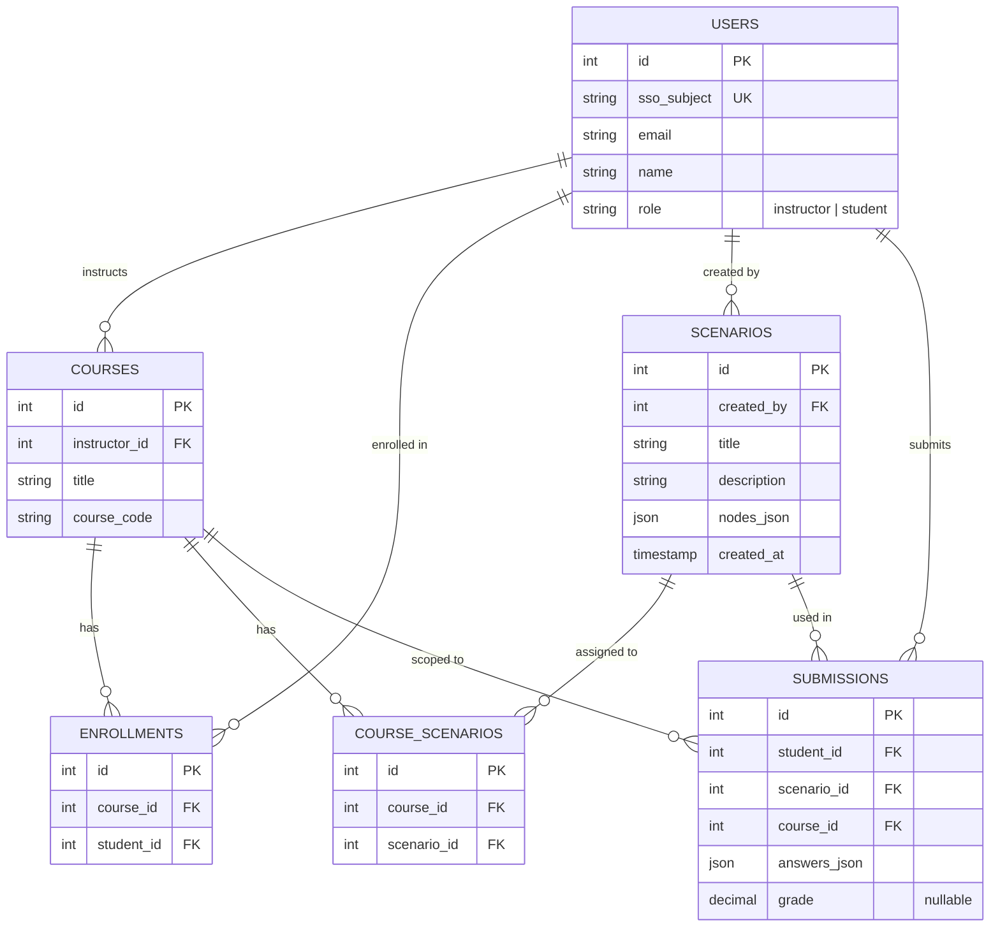

# Athletic Training App — Database Schema

```mermaid
erDiagram

    USERS {
        int id PK
        string sso_subject UK
        string email
        string name
        string role "instructor | student"
    }

    COURSES {
        int id PK
        int instructor_id FK
        string title
        string course_code
    }

    ENROLLMENTS {
        int id PK
        int course_id FK
        int student_id FK
    }

    SCENARIOS {
        int id PK
        int created_by FK
        string title
        string description
        json nodes_json
        timestamp created_at
    }

    COURSE_SCENARIOS {
        int id PK
        int course_id FK
        int scenario_id FK
    }

    SUBMISSIONS {
        int id PK
        int student_id FK
        int scenario_id FK
        int course_id FK
        json answers_json
        decimal grade "nullable"
    }

    USERS ||--o{ COURSES : "instructs"
    USERS ||--o{ ENROLLMENTS : "enrolled in"
    COURSES ||--o{ ENROLLMENTS : "has"
    USERS ||--o{ SCENARIOS : "created by"
    COURSES ||--o{ COURSE_SCENARIOS : "has"
    SCENARIOS ||--o{ COURSE_SCENARIOS : "assigned to"
    USERS ||--o{ SUBMISSIONS : "submits"
    SCENARIOS ||--o{ SUBMISSIONS : "used in"
    COURSES ||--o{ SUBMISSIONS : "scoped to"
```
