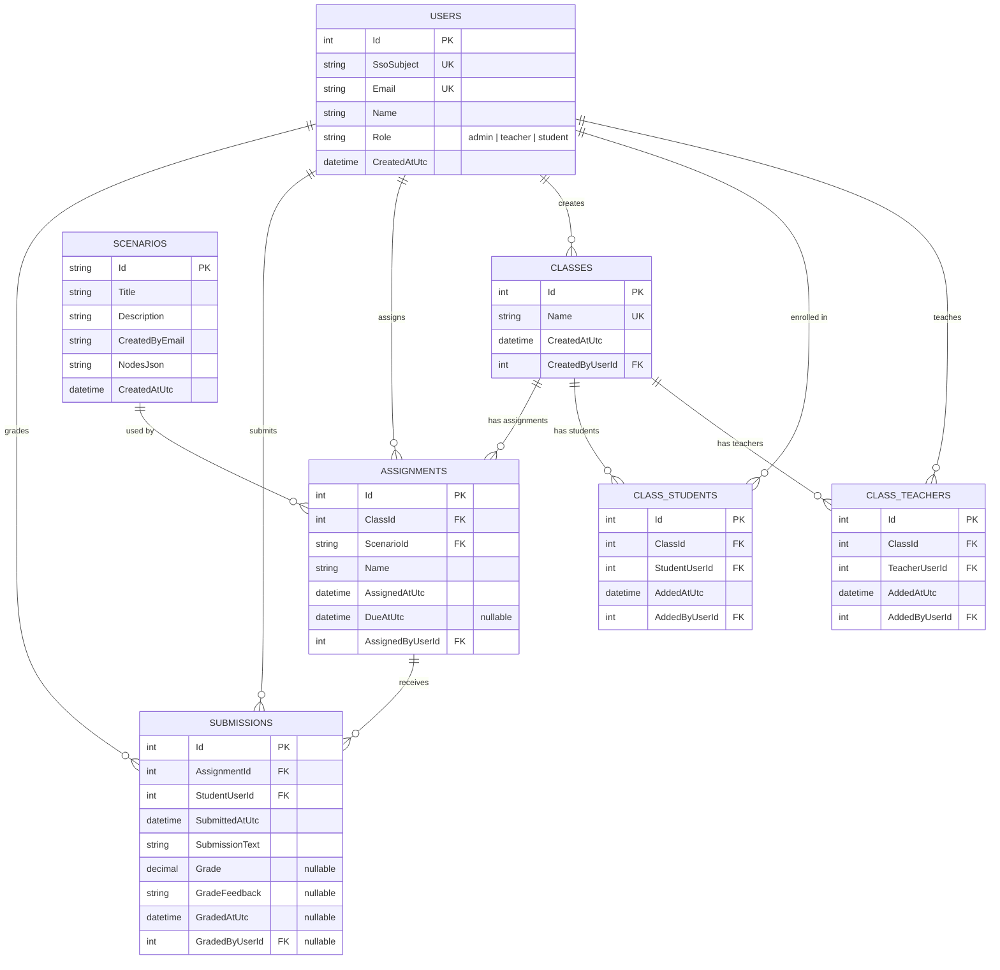

# Practice Before The Patient

An interactive medical training simulation platform built with .NET 9. Instructors create branching clinical scenarios and assign them to student cohorts; students work through decision trees to practice clinical reasoning before encountering real patients.

## Architecture

| Layer | Project | Description |
|-------|---------|-------------|
| Frontend | `PracticeBeforeThePatient.Web` | Blazor Server UI |
| Backend | `PracticeBeforeThePatient.Api` | ASP.NET Core Web API |
| Shared | `PracticeBeforeThePatient.Core` | Shared domain models |
| Database | PostgreSQL | EF Core persistence, migrations, and seeded starter data |

The supported runtime path in this repository is Docker Compose.

## Prerequisites

- Docker Desktop or Docker Engine
- Docker Compose

## Quick Start

Run the full stack:

```bash
docker compose up --build
```

Default endpoints:

- Web UI: `http://localhost:5009`
- API: `http://localhost:5186`
- PostgreSQL: `localhost:5432`

Default database settings come from `compose.yaml`:

- Database: `practicebeforethepatient`
- Username: `practicebeforethepatient`
- Password: `change-me`

These defaults are intended for local demos and development. If needed, Docker Compose environment variables can still be overridden at runtime.

## Swagger

Swagger is enabled only when the API runs in `Development`.

Example:

```powershell
$env:API_ENVIRONMENT = "Development"
docker compose up --build
```

Then open:

- `http://localhost:5186/swagger`

## Database Behavior

- The API applies EF Core migrations on startup.
- The API seeds starter scenarios and demo users into an empty database.
- PostgreSQL data is stored in the Docker volume `postgres-data`.

To reset local data completely:

```bash
docker compose down -v
docker compose up --build
```

## API Notes

- The web app is Blazor Server and calls the API from the server side.
- The browser is not calling the API directly across origins.
- CORS is not required for the supported deployment path and is not configured.

## Configuration

The Docker Compose file includes defaults for:

- `POSTGRES_DB`
- `POSTGRES_USER`
- `POSTGRES_PASSWORD`
- `POSTGRES_PORT`
- `API_PORT`
- `WEB_PORT`
- `API_ENVIRONMENT`
- `WEB_ENVIRONMENT`

If a demo environment needs different values, set those environment variables before starting Docker Compose.

## Database Schema



## Project Structure

```text
CS495-PracticeBeforeThePatient/
|-- PracticeBeforeThePatient.Api/
|-- PracticeBeforeThePatient.Web/
|-- PracticeBeforeThePatient.Core/
|-- PracticeBeforeThePatient.Tests/
|-- compose.yaml
|-- .dockerignore
`-- README.md
```

## Deployment Status

- Docker-based deployment assets are committed.
- No GitHub Actions deployment workflow is committed.
- No hosted infrastructure credentials are committed.

## Troubleshooting

### The site loads but no data appears

- Check the API logs first.
- If startup failed during database migration or seeding:

```bash
docker compose down
docker compose up --build
```

### You want a clean local database

```bash
docker compose down -v
docker compose up --build
```
