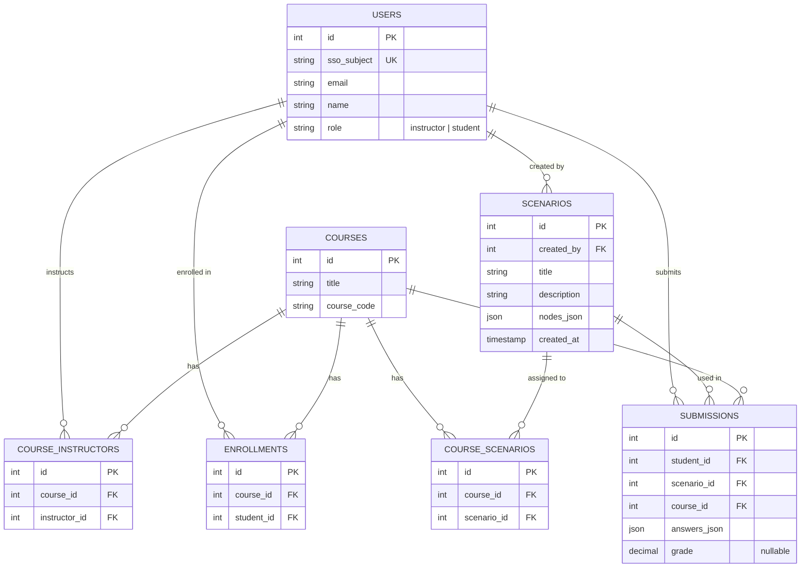

# Practice Before The Patient

An interactive medical training simulation platform built with .NET 9. Instructors create branching clinical scenarios and assign them to student cohorts; students work through the decision trees to practice diagnostic and treatment reasoning before encountering real patients.

---

## Table of Contents

- [Architecture](#architecture)
- [Prerequisites](#prerequisites)
- [Getting Started](#getting-started)
  - [Visual Studio (recommended)](#visual-studio-recommended)
  - [Command Line](#command-line)
- [Accessing the Application](#accessing-the-application)
- [API Documentation](#api-documentation)
- [Project Structure](#project-structure)
- [Configuration](#configuration)
- [Database Schema](#database-schema)
- [Troubleshooting](#troubleshooting)
- [License](#license)

---

## Architecture

| Layer | Project | Description |
|-------|---------|-------------|
| **Frontend** | `PracticeBeforeThePatient.Web` | Blazor Server application — simulation UI and scenario editor |
| **Backend** | `PracticeBeforeThePatient.Api` | ASP.NET Core Web API — scenarios, assignments, class rosters, and access control |
| **Shared** | `PracticeBeforeThePatient.Core` | Domain models shared across projects (`Scenario`, `Node`, `Choice`, `ClassRoster`) |

Both the Web and API projects are containerized with Docker and orchestrated via Docker Compose.

---

## Prerequisites

- [.NET 9 SDK](https://dotnet.microsoft.com/download/dotnet/9.0)
- [Docker Desktop](https://www.docker.com/products/docker-desktop/) (Windows, Mac, or Linux)
- [Visual Studio 2022](https://visualstudio.microsoft.com/) (v17.12+) with the **ASP.NET and web development** workload — *or* the [.NET CLI](https://learn.microsoft.com/dotnet/core/tools/)

> **Note:** Ensure Docker Desktop is running before starting the application.

---

## Getting Started

### Visual Studio (recommended)

1. Open `PracticeBeforeThePatient.sln` in Visual Studio 2022.
2. Set the startup project to **Docker Compose** using the toolbar dropdown.
3. Press **F5** to build the images, start the containers, and attach the debugger.

### Command Line

```bash
# Clone the repository
git clone https://github.com/kieraschnell/CS495-PracticeBeforeThePatient.git
cd CS495-PracticeBeforeThePatient

# Build and start all services
docker-compose up --build

# Or run in detached mode
docker-compose up -d --build

# View live logs (detached mode)
docker-compose logs -f

# Stop and remove containers
docker-compose down
```

---

## Accessing the Application

| Service | HTTP | HTTPS |
|---------|------|-------|
| **Web UI** | <http://localhost:5009> | <https://localhost:7124> |
| **API** | <http://localhost:5186> | <https://localhost:7144> |
| **Swagger UI** | — | <https://localhost:7144/swagger> |

> Swagger UI is available only when the API is running in the **Development** environment.

---

## API Documentation

The API exposes interactive documentation via **Swagger / OpenAPI**.

| Endpoint | Description |
|----------|-------------|
| `GET /api/access` | Retrieve the current user's access level and allowed scenarios |
| `POST /api/access/dev-user` | Set the active dev user (development only) |
| `POST /api/access/theme` | Set the UI theme for the current user |
| `GET /api/scenarios/{scenarioId}` | Fetch a scenario by ID |
| `POST /api/assignments/submit-scenario` | Submit a completed scenario assignment |
| `GET /api/classes` | List class rosters (admin) |

For the full, up-to-date endpoint list, visit the [Swagger UI](#accessing-the-application) while the API is running.

---

## Database Schema



---

## Project Structure

```
CS495-PracticeBeforeThePatient/
├── PracticeBeforeThePatient.Api/        # ASP.NET Core Web API
│   ├── Controllers/                     # API endpoints
│   │   ├── AccessController.cs          #   /api/access — user access & themes
│   │   ├── AssignmentsController.cs     #   /api/assignments — scenario submissions
│   │   ├── ClassManagementController.cs #   /api/classes — roster CRUD (admin)
│   │   └── ScenariosController.cs       #   /api/scenarios — scenario retrieval & editing
│   ├── Services/                        # Business logic & data stores
│   │   ├── ClassRosterStore.cs
│   │   ├── DevAccessStore.cs
│   │   └── EmailValidator.cs
│   ├── Data/scenarios/                  # Scenario JSON files
│   ├── Dockerfile
│   └── Program.cs
├── PracticeBeforeThePatient.Web/        # Blazor Server frontend
│   ├── Components/Pages/
│   │   ├── Simulation.razor.cs          # Student simulation runner
│   │   └── ScenarioEditor.razor.cs      # Instructor scenario editor
│   ├── Services/
│   │   └── ApiClient.cs                 # Typed HTTP client for the API
│   ├── Dockerfile
│   └── Program.cs
├── PracticeBeforeThePatient.Core/       # Shared domain models
│   └── Models/
│       ├── Scenario.cs
│       ├── Node.cs
│       ├── Choice.cs
│       └── ClassRoster.cs
├── docker-compose.yml
├── docker-compose.override.yml
└── README.md
```

---

## Configuration

Key settings are managed through environment variables in `docker-compose.override.yml`:

| Variable | Service | Default | Description |
|----------|---------|---------|-------------|
| `ASPNETCORE_ENVIRONMENT` | Both | `Development` | Runtime environment (`Development`, `Production`) |
| `ASPNETCORE_HTTP_PORTS` | Both | `8080` | Internal HTTP port |
| `ASPNETCORE_HTTPS_PORTS` | Both | `8081` | Internal HTTPS port |
| `ApiBaseUrl` | Web | `http://practicebeforethepatient.api:8080/` | Base URL the Blazor app uses to reach the API |

Port mappings (host → container) can be customized in `docker-compose.override.yml`.

---

## Troubleshooting

### Docker Containers Won't Start
- Ensure Docker Desktop is running.
- Inspect logs: `docker-compose logs`
- Rebuild from scratch: `docker-compose down && docker-compose up --build`
- Verify no port conflicts on the host machine.

### API Connection Issues
- Confirm both containers are healthy: `docker-compose ps`
- Check individual service logs:
  ```bash
  docker-compose logs practicebeforethepatient.api
  docker-compose logs practicebeforethepatient.web
  ```

### Port Already in Use
- Stop any running instances: `docker-compose down`
- Identify conflicting processes on ports **5009**, **5186**, **7124**, or **7144**.
- Adjust port mappings in `docker-compose.override.yml` if needed.

---

## License

This project is developed as part of **CS 495** coursework. See the repository for any applicable license terms.

