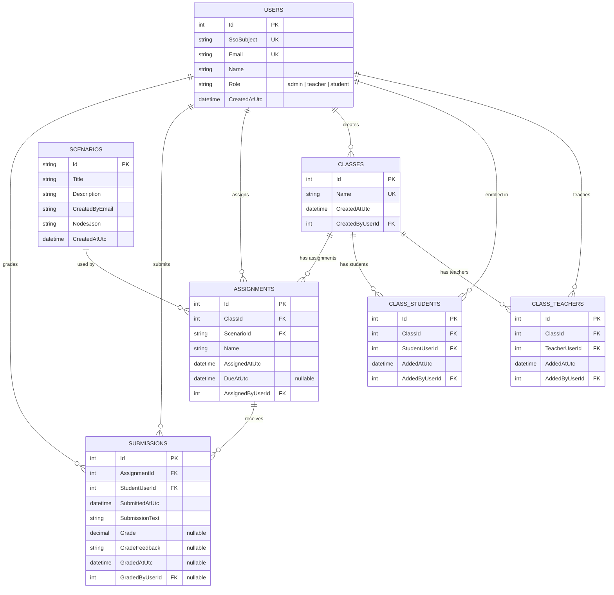

# Practice Before The Patient

An interactive medical training simulation platform built with .NET 9. Instructors create branching clinical scenarios and assign them to student cohorts; students work through the decision trees to practice diagnostic and treatment reasoning before encountering real patients.

---

## Table of Contents

- [Architecture](#architecture)
- [Prerequisites](#prerequisites)
- [Getting Started](#getting-started)
  - [Visual Studio (recommended)](#visual-studio-recommended)
  - [Command Line](#command-line)
- [Accessing the Application](#accessing-the-application)
- [API Documentation](#api-documentation)
- [Project Structure](#project-structure)
- [Configuration](#configuration)
- [Database Schema](#database-schema)
- [Troubleshooting](#troubleshooting)
- [License](#license)

---

## Architecture

| Layer | Project | Description |
|-------|---------|-------------|
| **Frontend** | `PracticeBeforeThePatient.Web` | Blazor Server application — simulation UI and scenario editor |
| **Backend** | `PracticeBeforeThePatient.Api` | ASP.NET Core Web API — scenarios, assignments, class rosters, and access control |
| **Shared** | `PracticeBeforeThePatient.Core` | Domain models shared across projects (`Scenario`, `Node`, `Choice`, `ClassRoster`) |

Data is persisted with **Entity Framework Core** and **SQLite**.

---

## Prerequisites

- [.NET 9 SDK](https://dotnet.microsoft.com/download/dotnet/9.0)
- [Visual Studio 2022](https://visualstudio.microsoft.com/) (v17.12+) with the **ASP.NET and web development** workload — *or* the [.NET CLI](https://learn.microsoft.com/dotnet/core/tools/)

---

## Getting Started

### Visual Studio (recommended)

1. Open `CS495-PracticeBeforeThePatient.sln` in Visual Studio 2022.
2. Right-click the **Solution** in Solution Explorer → **Configure Startup Projects…**
3. Select **Multiple startup projects** and set both **PracticeBeforeThePatient.Api** and **PracticeBeforeThePatient.Web** to **Start**.
4. Ensure both projects are using the **https** launch profile.
5. Press **F5** to build and run with the debugger attached.

### Command Line

```bash
# Clone the repository
git clone https://github.com/kieraschnell/CS495-PracticeBeforeThePatient.git
cd CS495-PracticeBeforeThePatient

# Start the API (terminal 1)
dotnet run --project PracticeBeforeThePatient.Api --launch-profile https

# Start the Web app (terminal 2)
dotnet run --project PracticeBeforeThePatient.Web --launch-profile https
```

---

## Accessing the Application

| Service | HTTP | HTTPS |
|---------|------|-------|
| **Web UI** | <http://localhost:5009> | <https://localhost:7124> |
| **API** | <http://localhost:5186> | <https://localhost:7144> |
| **Swagger UI** | — | <https://localhost:7144/swagger> |

> Swagger UI is available only when the API is running in the **Development** environment.

---

## API Documentation

The API exposes interactive documentation via **Swagger / OpenAPI**.

| Endpoint | Description |
|----------|-------------|
| `GET /api/access` | Retrieve the current user's access level and allowed scenarios |
| `POST /api/access/dev-user` | Set the active dev user (development only) |
| `POST /api/access/theme` | Set the UI theme for the current user |
| `GET /api/scenarios/{scenarioId}` | Fetch a scenario by ID |
| `POST /api/assignments/submit-scenario` | Submit a completed scenario assignment |
| `GET /api/classes` | List class rosters (admin) |

For the full, up-to-date endpoint list, visit the [Swagger UI](#accessing-the-application) while the API is running.

---

## Database Schema



---

## Project Structure

```
CS495-PracticeBeforeThePatient/
├── PracticeBeforeThePatient.Api/        # ASP.NET Core Web API
│   ├── Controllers/                     # API endpoints
│   │   ├── AccessController.cs          #   /api/access — user access & themes
│   │   ├── AdminUsersController.cs      #   /api/admin/users — user management
│   │   ├── AssignmentsController.cs     #   /api/assignments — scenario submissions
│   │   ├── ClassManagementController.cs #   /api/classes — roster CRUD
│   │   └── ScenariosController.cs       #   /api/scenarios — scenario retrieval & editing
│   ├── Data/
│   │   ├── AppDbContext.cs              # EF Core DbContext (SQLite)
│   │   └── Entities/                    # Database entity classes
│   ├── Services/
│   │   ├── DevAccessStore.cs            # Dev-mode user switching
│   │   └── EmailValidator.cs
│   └── Program.cs
├── PracticeBeforeThePatient.Web/        # Blazor Server frontend
│   ├── Components/Pages/
│   │   ├── Simulation.razor.cs          # Student simulation runner
│   │   └── ScenarioEditor.razor.cs      # Instructor scenario editor
│   ├── Services/
│   │   └── ApiClient.cs                 # Typed HTTP client for the API
│   └── Program.cs
├── PracticeBeforeThePatient.Core/       # Shared domain models
│   └── Models/
│       ├── Scenario.cs
│       ├── Node.cs
│       ├── Choice.cs
│       └── ClassRoster.cs
├── .github/workflows/deploy.yml         # CI/CD — auto-deploy on push to main
├── .gitignore
└── README.md
```

---

## Configuration

Configuration is managed through `appsettings.{Environment}.json` files:

| Setting | Project | Dev Value | Prod Value | Description |
|---------|---------|-----------|------------|-------------|
| `ASPNETCORE_ENVIRONMENT` | Both | `Development` | `Production` | Runtime environment |
| `ApiBaseUrl` | Web | `http://localhost:5186/` | `http://localhost:5100/` | Base URL the Blazor app uses to reach the API |

### Local Development Ports

| Service | HTTP | HTTPS |
|---------|------|-------|
| **API** | `localhost:5186` | `localhost:7144` |
| **Web** | `localhost:5009` | `localhost:7124` |

### Production Deployment

The application is deployed to a GCP Compute Engine VM with:
- **Caddy** reverse proxy (auto-HTTPS via Let's Encrypt)
- **systemd** services for both API and Web
- **GitHub Actions** CI/CD (auto-deploy on push to `main`)

---

## Troubleshooting

### API Connection Issues
- Ensure both projects are running (multi-project startup or two terminals).
- Verify `ApiBaseUrl` in `appsettings.Development.json` matches the API's launch profile port.

### Port Already in Use
- Identify conflicting processes on ports **5009**, **5186**, **7124**, or **7144**.
- Stop any other `dotnet` processes: `dotnet build-server shutdown`

### Database Issues
- The SQLite database (`app.db`) is created automatically on first run via EF Core migrations.
- To reset the database, delete `PracticeBeforeThePatient.Api/Data/app.db` and restart the API.

---

## License

This project is developed as part of **CS 495** coursework. See the repository for any applicable license terms.

