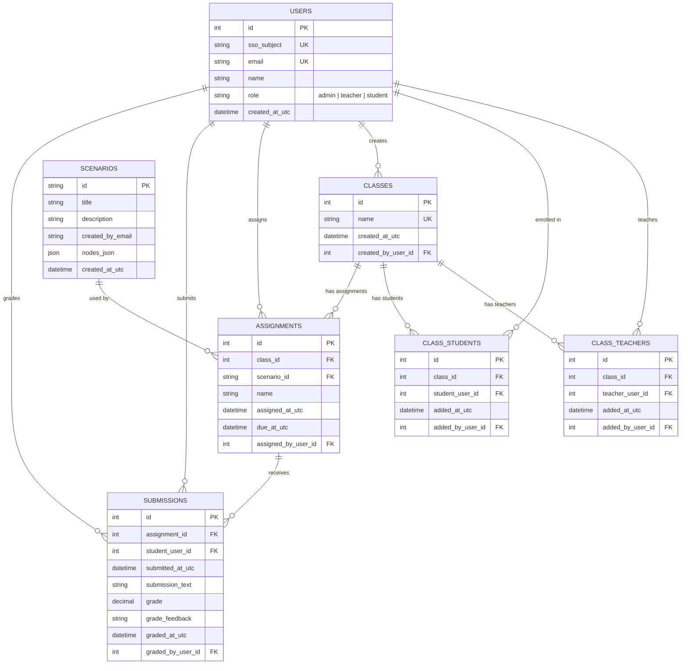

# Proposed EF Diagram

This proposes a normalized Entity Framework data model to support the current frontend behavior:

- admins can manage teachers and other admins
- teachers can manage only their own classes
- classes have many teachers and many students
- teachers assign scenarios to classes
- students submit work for assignments

## Notes

- `USERS.role` handles platform-level access: `admin`, `teacher`, `student`.
- Class ownership and visibility should come from `CLASS_TEACHERS`, not from the global role alone.
- `CLASS_TEACHERS` allows multiple teachers on one class.
- `CLASS_STUDENTS` replaces storing student emails directly on the class record.
- `ASSIGNMENTS` should be a real table instead of JSON embedded in class data.
- `SUBMISSIONS` should belong to a specific assignment, which avoids ambiguity when the same scenario is assigned more than once.

## Recommended EF navigation shape

- `User`
  - `CreatedClasses`
  - `TeachingAssignments`
  - `StudentEnrollments`
  - `AssignedAssignments`
  - `SubmittedAssignments`
  - `GradedSubmissions`
- `Class`
  - `CreatedBy`
  - `Teachers`
  - `Students`
  - `Assignments`
- `Assignment`
  - `Class`
  - `Scenario`
  - `AssignedBy`
  - `Submissions`
- `Submission`
  - `Assignment`
  - `Student`
  - `GradedBy`
